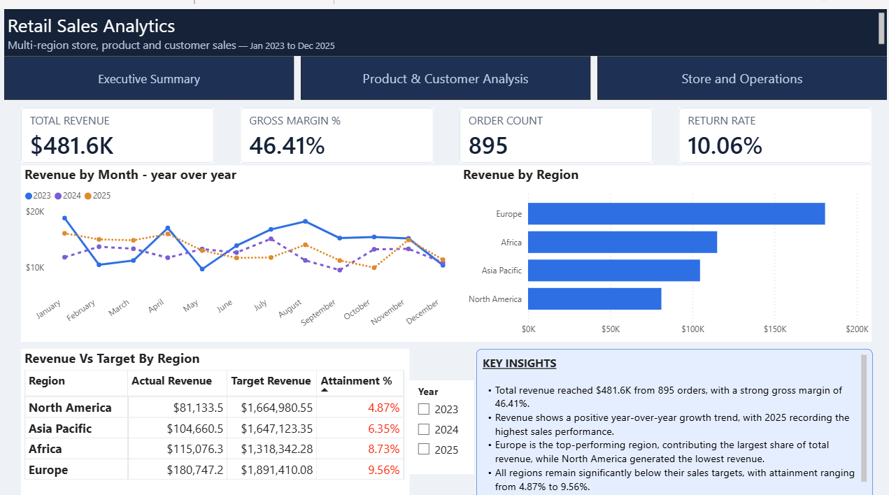

### 📊 Retail Sales Analytics

**Overview:**
An end-to-end Power BI business intelligence project that turns a messy, real-world-style Excel export into a governed data model and a fully interactive 3-page executive dashboard. The source workbook simulates a legacy retail order system — 8 loosely related sheets covering orders, customers, products, stores, regions, employees, returns, and budget targets — deliberately riddled with mixed date formats, nulls, duplicates, and inconsistent formatting.

**Business Problem:**
With sales data scattered across disconnected tables, stakeholders had no reliable way to answer basic questions: What's total revenue and margin, and how is it trending? How are actuals tracking against budget by region? Which products and segments drive the most profit? Where are returns concentrated?

**Process:**
- **Import & audit** — connected all 8 raw sheets via Power Query without any pre-cleaning
- **Data cleaning** — resolved mixed date formats, null values, 15 duplicate rows, negative quantities, floating-point rounding noise, and inconsistent text casing using documented, repeatable Power Query steps
- **Data modeling** — built a star-schema model with correct relationship cardinality, including a custom DAX Date table to resolve a grain mismatch between the Targets and Orders tables
- **DAX measures** — wrote a full measure library covering revenue, cost, margin, order volume, return rate, YoY growth, and actual-vs-target attainment
- **Report design** — built a 3-page report (Executive Summary, Product & Customer Analysis, Store & Operations) with KPI cards, trend charts, synced slicers, and bookmark-driven views

**Key Business Insights:**
- Revenue and margins look healthy in isolation, but every region is landing at only 10–16% of its budget target
- The Ergonomic Chair alone drives ~10% of total revenue; several mid-cost products (Kettle, Notebook Pack, Smartwatch) trail at 27–29% margin vs. 55–60% for peers at similar cost — a pricing-review shortlist
- Store and employee performance are tightly and healthily distributed, but Electronics stands out with below-average revenue and above-average returns — a candidate for root-cause investigation

**Skills Demonstrated:**
- Data cleaning & ETL (Power Query)
- Star-schema data modeling
- DAX (SUMX, RELATED, DISTINCTCOUNT, DIVIDE, time intelligence, variables)
- Interactive dashboard design (KPI cards, synced slicers, bookmarks, conditional formatting)

**Tools:** Power BI Desktop, Excel

**Files:**
- [`Retail Sales Analytics.pbix`](Retail%20Sales%20Analytics.pbix) — Power BI file
- [Dashboard Screenshot.png](Retail-Report.png) — Preview image
